# What’s In Your Fridge App  
https://velvetred2020.github.io/food-no-brainer-app/

## 📌 Project Overview

This is a modern and responsive **React-based recipe finder** that helps users cook using the ingredients they already have at home.

Instead of searching for recipes and then buying ingredients, this app reverses the process:  
👉 Users enter what’s in their fridge, and the app suggests recipes that match those ingredients.

The application uses the **TheMealDB API** (free tier) and includes features like **ingredient filtering, caching, dark/light mode**, and a **multi-step interactive UI**.

---

## ⚙️ Installation Instructions

Follow these steps to run the project locally:

1. **Clone the repository**

```bash
git clone <your-repo-url>
cd your-repo
 ```
2. **Ensure file structure**
```
food-app/
├── img/
│   ├── plate-light.png
│   ├── plate-dark.png
│   ├── meals-light.png
│   ├── meals-dark.png
│   ├── add-ingredients-light.png
│   ├── add-ingredients-dark.png
│   ├── ingredients-light.png
│   ├── ingredients-dark.png
│   ├── recipe-found-light.png
│   ├── recipe-found-dark.png
│   ├── recipe-details-light.png
│   ├── recipe-details-dark.png
│
├── public/
├── src/
│   ├── components/
│   ├── data/
│   ├── styles/
│   └── main.tsx / App.tsx
│
├── index.html
├── package.json
├── package-lock.json
├── vite.config.ts
├── tsconfig.json
├── tsconfig.app.json
├── tsconfig.node.json
├── eslint.config.js
├── .gitignore
└── README.md
```
3. **Install dependencies**
```
npm install
```
4. **Run the app**
```
npm run dev
```
## 🚀 Usage Guide

1. Open the app in your browser  
2. Click on the plate 🍽️ to start  
3. Select a meal type:
   - Breakfast
   - Lunch
   - Dinner
   - Snack  
4. Enter the ingredients you have in your fridge  
5. Click **"Find recipes 🍽️"**  
6. Browse recipes that match your ingredients  
7. Click a recipe to view full details  

---

## 🌙 Dark Mode

- Toggle using the button in the top-right corner  
- Mode is saved in `localStorage`  
- Fully styled dark theme across all components  

---

## 🧊 Ingredient System

- Autocomplete suggestions while typing  
- Only valid ingredients are accepted  
- Prevents duplicates  
- Ingredients can be removed dynamically  

---

## 🔍 Recipe Matching Logic

The app ensures accurate results by:

- Fetching recipes for each ingredient  
- Computing the intersection of results  
- Filtering recipes that include **ALL selected ingredients**  

This avoids irrelevant or partial matches.

---

## ⚡ Performance Optimization

To improve performance and reduce API usage:

### 💾 Ingredient Caching

- Ingredient list is cached for **7 days**  
- Stored in `localStorage`  
- Avoids repeated API calls  

### 🚀 Efficient Fetching

- Uses parallel API requests (`Promise.all`)  
- Filters results client-side for accuracy  

---

## 📱 Responsive Design

- Mobile-first UI  
- Works across:
  - Mobile  
  - Tablet  
  - Desktop  

- Adaptive layouts for recipe grids and cards  

---

## 📸 Screenshots

### 🌞 Light Mode

Plate  
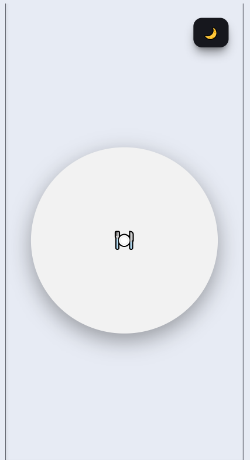

Meals  
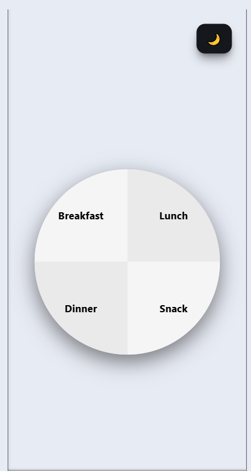

Add Ingredients  
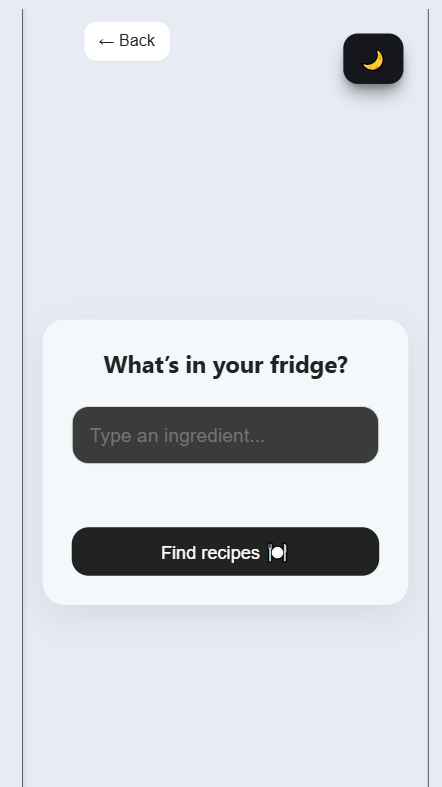

Ingredients  
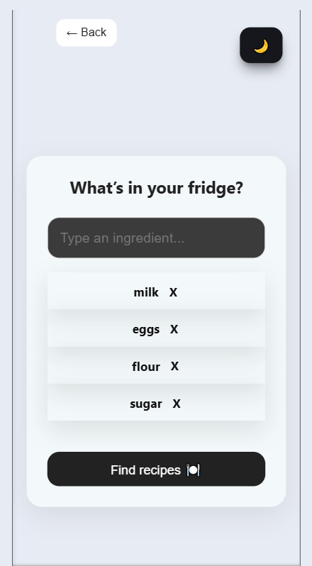

Recipes Found  
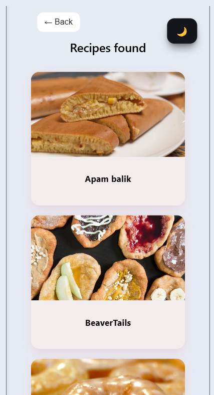

Recipe Details  
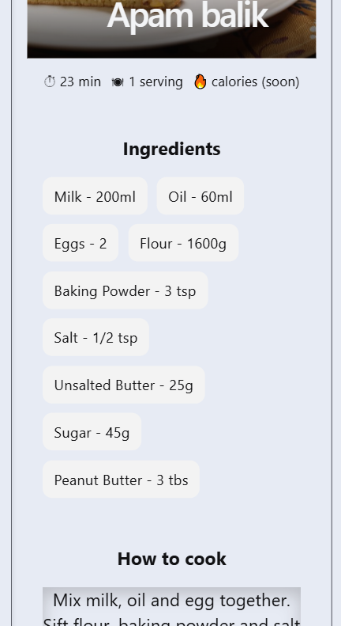

---

### 🌙 Dark Mode

Plate  
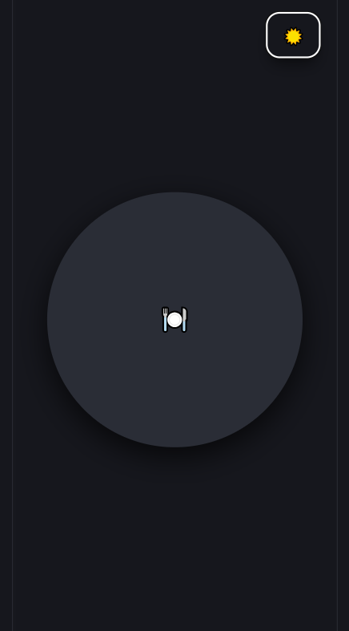

Meals  
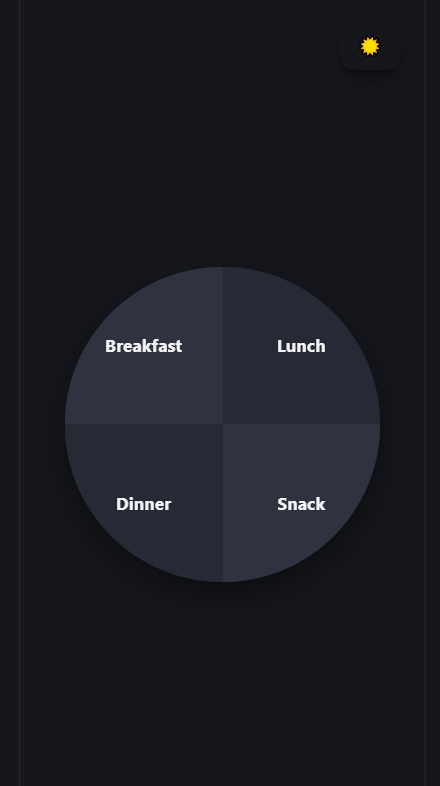

Add Ingredients  
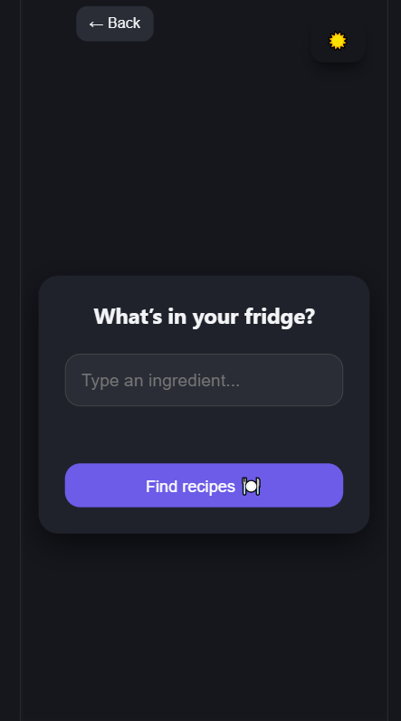

Ingredients  
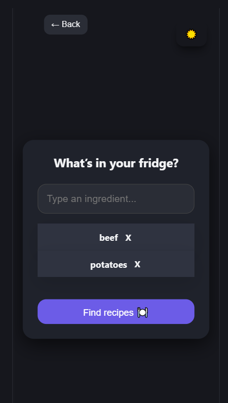

Recipes Found  
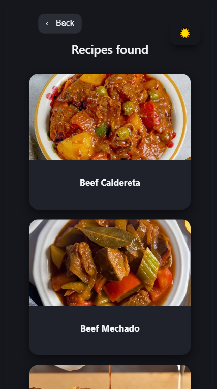

Recipe Details  
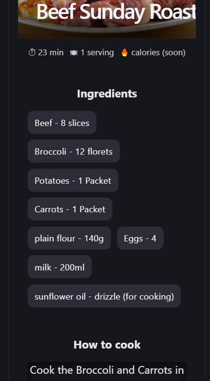

---

## ✨ Features

- Interactive plate-based navigation  
- Ingredient input with autocomplete  
- Smart recipe filtering (strict matching)  
- Detailed recipe view (ingredients + instructions)  
- Dark / Light mode toggle  
- Ingredient caching (7 days)  
- Optimized API usage  
- Fully responsive design  
- Clean UI with animations  

---

## ⚠️ Error Handling

The app handles common scenarios gracefully:

- No ingredients selected → no API call  
- No recipes found → empty results state  
- API errors → handled safely  
- Duplicate ingredients → prevented  

---

## 🌐 API Information

This app uses the free **TheMealDB API**.

### Ingredient List

https://www.themealdb.com/api/json/v1/1/list.php?i=list

### Filter by Ingredient

https://www.themealdb.com/api/json/v1/1/filter.php?i={ingredient}

### Recipe Details

https://www.themealdb.com/api/json/v1/1/lookup.php?i={id}


---

## 🔒 API Usage Strategy

- Uses only free endpoints (no API key required)  
- Reduces calls via caching  
- Filters data client-side for precision  

---

## 🔮 Future Enhancements

- Real calorie data  
- Real cooking time from API  
- Favorite recipes system  
- Shopping list generator  
- Advanced filters (diet, cuisine, etc.)  
- Multi-language support  
- UI/UX improvements  

---

## 📄 License

This project is open-source and free to use for educational purposes.

---

## 🧑‍💻 Notes

- Built with React + TypeScript  
- Uses TheMealDB free API  
- No backend required  
- Ingredient matching is strict  
- Some values (like cooking time) are currently mocked  

---

## 🎯 Project Goal

This project demonstrates:

- React state management without routing  
- API integration and filtering logic  
- Caching strategies using localStorage  
- Responsive UI design  
- Component-based architecture  
- Real-world UX flow  
